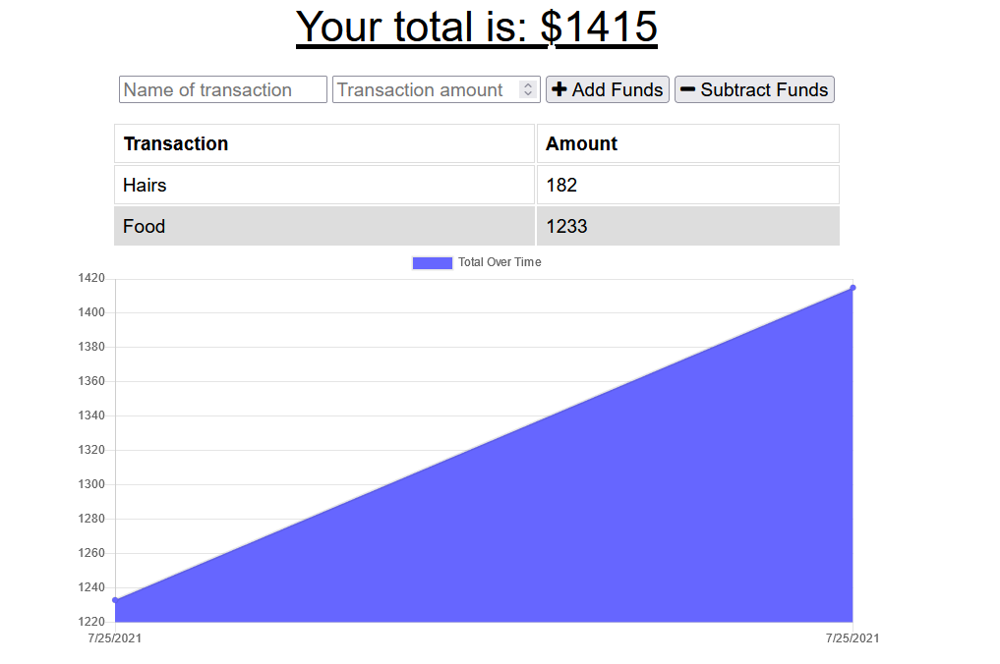

# Expense/Budget Tracker

## Deployed Heroku Link

[Weather Dashboard](https://lw-pwa-budget-tracker.herokuapp.com)

## Description

The Expense/Budget Tracker utilises MongoDB, Mongoose, and Express to allow users to log and keep track of their expenses using a generated graph. You can enter a transaction name and the amount that was added or taken away.

## Table of Contents

- [Expense/Budget Tracker](#expensebudget-tracker)
  - [Deployed Heroku Link](#deployed-heroku-link)
  - [Description](#description)
  - [Table of Contents](#table-of-contents)
  - [Screenshots](#screenshots)
  - [Tech/framework used](#techframework-used)
  - [Features](#features)
  - [Tests](#tests)
  - [Contact](#contact)

## Screenshots

Dashboard:

## Tech/framework used

<b>Built with</b>

- [MongoDB](https://www.mongodb.com/)
- [Mongoose](https://www.npmjs.com/package/mongoose)
- [Express](https://www.npmjs.com/package/express)

## Features

- Add expenses with a transaction name
- Subtract expenses with a transaction name
- View transactions on a generated graph

## Tests

N/A

## Contact

For any issues, please contact [my email](mailto:leonwheeler08@gmail.com) 😀
